# Code Interpreter (コード通訳) — User Manual

**Read and review AI-generated code in plain English, even if you can't read code.**
This manual takes 5 minutes. No jargon.

---

## What you get

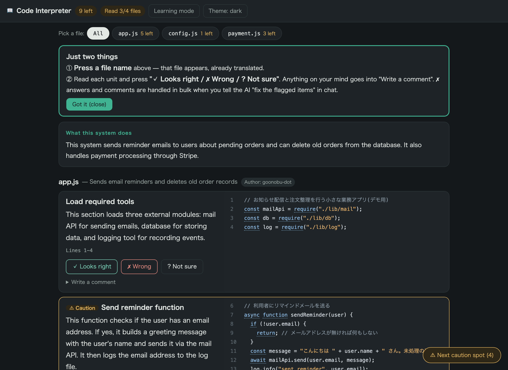

Your code is displayed in "units of meaning" (a few lines each): **plain-English explanation on the left, the actual code on the right**.
All you do is read the explanation and **press one of three buttons**.

On narrow screens (a side panel next to Claude Code, or a phone) the layout automatically
stacks vertically — explanation above, code below. Same features either way.

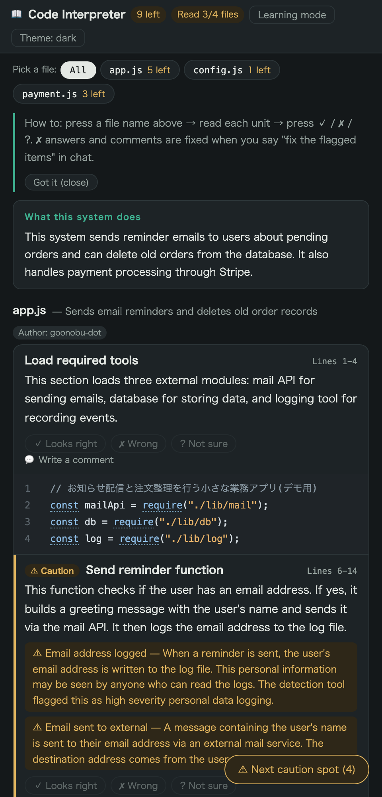

---

## 0. Open it (first time only)

Three ways, same screen:

| How | Steps |
|---|---|
| **A. Ask in chat** (Claude Code users) | Ask Claude to "translate the code" |
| **B. Double-click** | Double-click the launcher file placed in your project folder on first run |
| **C. Command line** | `code-translate <your-project> --open --lang en` |

### ⏳ There is a wait before the view opens (most important note)

The tool **first has AI read and translate the whole codebase, then opens the view**.
Nothing appears instantly — you wait for the translation to finish.

**Rule of thumb: about 1.5 minutes per 1,000 lines of code** (measured; more files means more parallelism, so larger projects scale better than linearly).

| Size of the codebase | Typical wait |
|---|---|
| Small app (up to ~200 lines) | **~2 minutes** |
| Medium app (~3,000 lines) | **~5 minutes** |
| Larger app (~8,000 lines) | **~12 minutes** |

Big projects can exceed 10 minutes. While it runs you see live progress — `[7/35] path/to/file (about 4.2 min left)` — so you can tell it is working, not stuck.

- The page stays closed while it runs and opens automatically when done
- You can keep asking for other work in chat while you wait
- **From the second run on it opens instantly** unless the code changed; only changed parts are redone
- Stopping midway breaks nothing — ask again and it resumes

**About cost**: translation runs inside your existing **Claude Code plan — there is no extra charge** (it is covered by Pro/Max and similar plans). Only if you run Claude with your own API key does it consume API usage as usual.

Use `--lang en` for English output; the UI follows the translation language automatically.

---

## 1'. Colors show you what matters

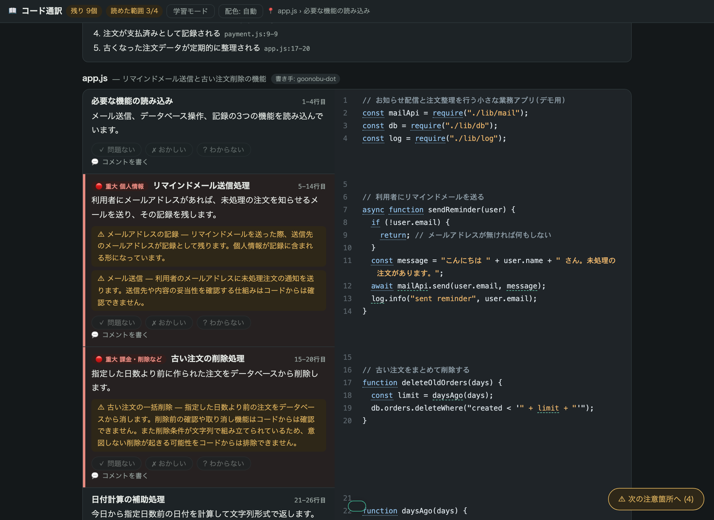

Some parts of a codebase can cause real harm. Those are marked in four levels.

| Color | Meaning | Examples |
|---|---|---|
| 🔴 **Serious** | could cause real harm | sending data out, charging money, deleting, personal data |
| 🟠 **Check this** | worth confirming | failure handling, outside components |
| 🔵 **Good to know** | minor notes | small caveats |
| none | ordinary code | loading, rendering |

Each unit shows a chip ("🔴 Serious charges / deletes"), a colored bar on the left, and a soft tint.
**Sending data out, charging or deleting, and personal data are raised to red even at medium severity** —
those are what a non-engineer most needs to know.

**Short on time? Press "🔴 Risky parts only"** to narrow the page down to what matters.

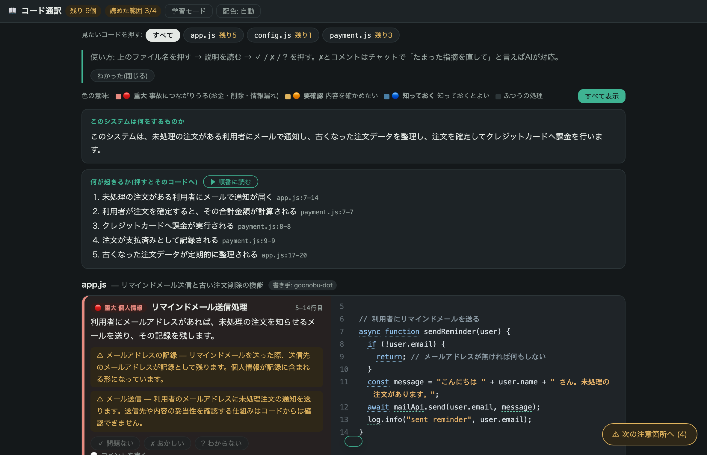

> Colors are the AI's reading, not a safety guarantee. The redder it is, the more you should
> compare the explanation against the real code on the right.

---

## 1. Press the file you want to see

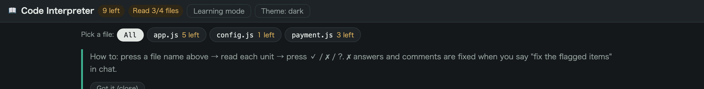

File-name buttons sit at the top. Press one and that file appears, already translated.
"N left" shows how many units you haven't reviewed; it turns "✓" when done.
"All" shows every file in order.

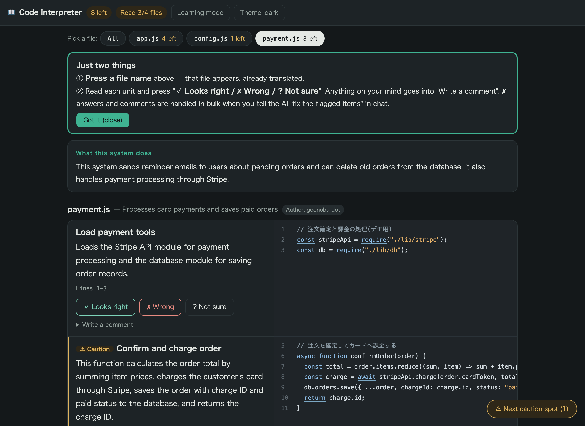

---

## 2. Read

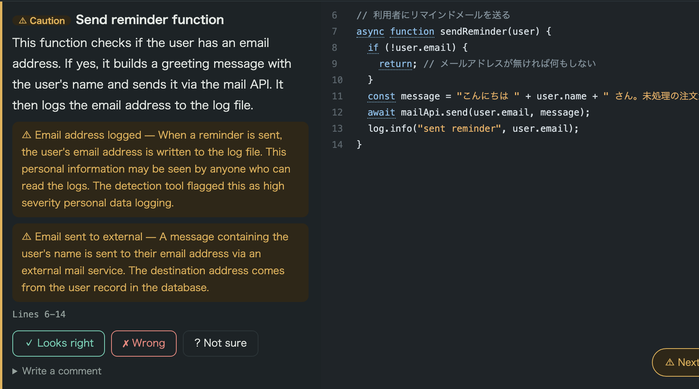

Each card is a **few-line unit of meaning**:

| Where | What it is |
|---|---|
| **Bold heading (left)** | What these lines do, in one phrase |
| **Left paragraph** | The detailed plain-English explanation |
| **Dark area (right)** | The actual code; **hover a line to see its one-line translation** |

Cards marked **⚠ Caution** touch money, personal data, or deletion — the places where accidents happen.
The amber box explains what to watch for. The floating "⚠ Next caution spot" button tours only the ⚠ cards.

> The demo app in these screenshots contains some Japanese strings in its source code —
> the tool explains code in English regardless of what language the code's comments are written in.

---

## 3. Answer

This is **not a quiz**. You are only answering: "is this what I asked for?"

| Button | Press when | Then |
|---|---|---|
| **✓ Looks right** | The behavior matches your intent | Recorded; move on |
| **✗ Wrong** | You never asked for this / it looks wrong | Say "fix the flagged items" in chat and the AI fixes them |
| **? Not sure** | You can't judge | Ask in chat and the AI explains further |

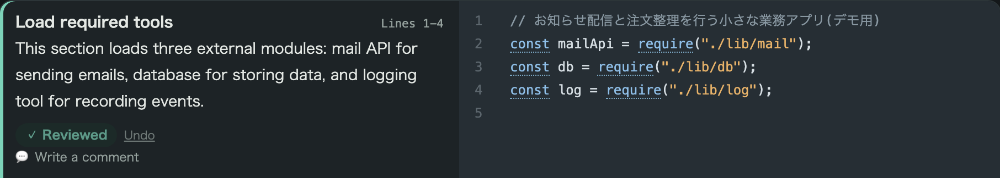

"Undo" reverts a mis-press. **Pressing a button never changes the code** — it only records
your judgment. Fixes happen only when you ask for them in chat.

---

## 4. Write comments

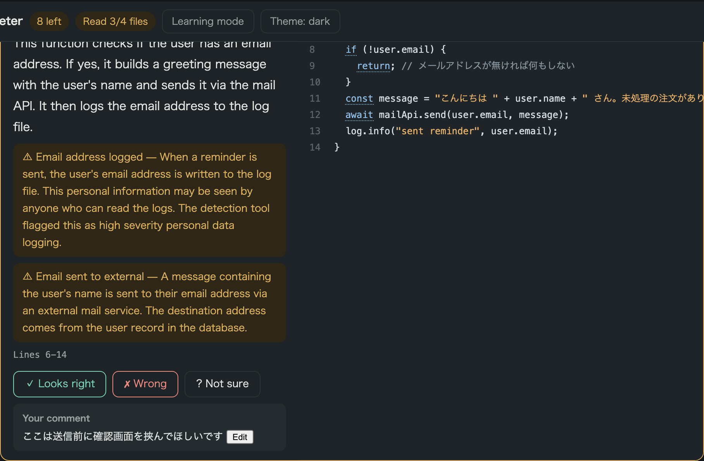

Open "Write a comment" and type in ordinary language, e.g. "add a confirmation screen before sending".
Like ✗ answers, comments are picked up by the AI when you say "fix the flagged items" in chat.

### Or press "📮 Send flags to the AI"

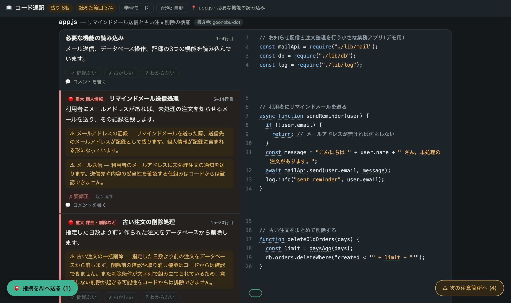

As soon as you have one ✗, ? or comment, a button appears at the bottom left. One press sends them.

- **On the shareable page (ctrl+])** — the page saves your answers and notifies the AI.
  Then just say "fix the flagged items" in chat.
- **In a browser** — the list is copied to your clipboard; paste it into chat.

Either way the result is the same. **You never have to figure out how to phrase it.**

---

## 5. Check the verdict at the bottom

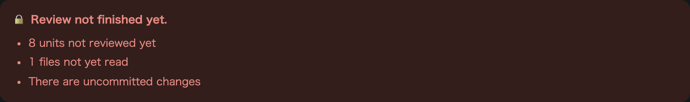

When every unit is answered "✓ Looks right", no file is unread, nothing critical was detected,
and the code is committed, the bottom turns green: "✅ Everything reviewed."
While red, the reasons are listed. **This tool never says "it's safe."**
It only shows, honestly, what you reviewed and what remains unverified.

---

## Bonus: Learning mode

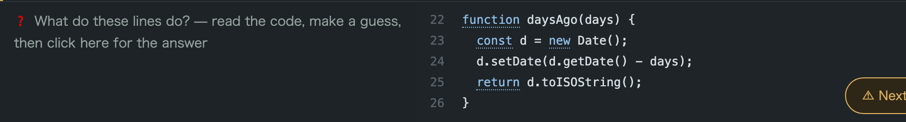

Press "Learning mode" in the header: explanations are hidden and replaced by
"❓ What do these lines do?" — **read the code, make a guess, click to check the answer**.
The same active-recall loop as language flashcards. (⚠ cards stay visible for safety.)

---

## FAQ

**Q. What happens to my answers when the code changes?**
They are invalidated automatically and every card resets — approvals of old code are never carried over to new code. The screen switches to the new translation on its own.

**Q. What does it cost?**
**No extra charge.** Translation runs inside your existing Claude Code plan (Pro/Max and similar), and opening the view is always free. Only if you run Claude with your own API key does it consume API usage as usual.

**Q. Can the translation be wrong?**
Yes — it is AI-generated. That's why the real code always sits next to the explanation, and unread files are shown in red. Use the ⚠ marks and the verdict, not the translation alone.

**Q. Where are my answers and comments stored?**
In `.code-translate/view/review.json` inside your project. The AI reads this file to apply fixes. Nothing is sent anywhere else.
