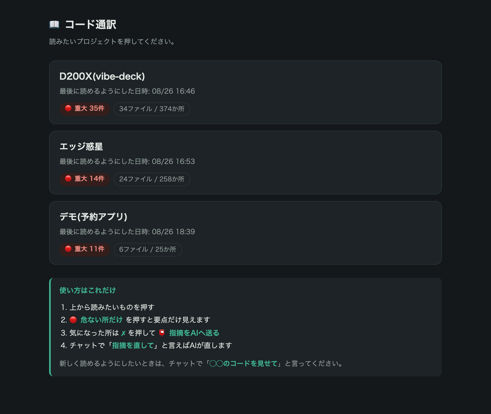
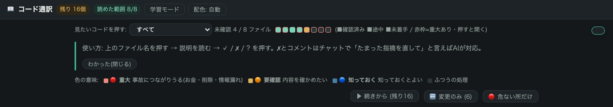

# コード通訳 使い方の手順書

**コードが読めなくても、AIが書いたコードを日本語で読んで、自分の言葉で確認できるツールです。**
このマニュアルは5分で読めます。むずかしい言葉は使いません。

---

## いちばん大事なこと

**覚えるのは、この一言だけです。**

> チャットで「**◯◯のコードを見せて**」

これだけで、AIが翻訳してリンクを1本渡します。**あなたが探すものは何もありません。**

---

## 手順1 — 読めるようにする

チャットに、こう打ってください(プロジェクトの名前を入れます)。

> **エッジ惑星のコードを見せて**

**待ち時間があります。** AIがコード全体を読んでから画面を作るので、押してすぐには出ません。

| コードの量 | 待ち時間の目安 |
|---|---|
| 小さいアプリ(〜200行) | 約2分 |
| 中くらい(約3,000行) | 約5分 |
| 大きめ(約8,000行) | 約12分 |

終わるとリンクが届きます。**2回目からは、変わった所だけ訳すので数十秒で済みます。**

> **お金の話**: 翻訳はお使いのClaude Codeの利用枠の中で動きます。**追加の請求はありません**。

---

## 手順2 — ホームから選ぶ

`ctrl` と `]` を同時に押すと、翻訳したプロジェクトの一覧が出ます。読みたいものを押してください。

各項目には「🔴 重大 ◯件」「◯ファイル / ◯か所」が出ているので、**どれを見るべきか選べます**。

---

## 手順3 — どこまで見たかを確認する

画面の上に、**小さな四角が並んだ帯**があります。**四角1つがファイル1つ**です。

| 色 | 意味 |
|---|---|
| 🟩 緑 | 全部確認済み(もう読まなくていい) |
| 🟧 黄 | 途中まで見た |
| ⬜ 灰 | まだ手を付けていない |
| **赤い枠** | 重大な箇所を含むファイル |

**押せばそのファイルが開きます。** マウスを乗せるとファイル名と残りの数が出ます。

---

## 手順4 — 読む量を減らす

全部読む必要はありません。画面の右上に3つのボタンがあります。

| ボタン | いつ使うか |
|---|---|
| **▶ 続きから (残り◯)** | 前回の続き。**答えていない所だけ**が並びます |
| **🆕 変更のみ (◯)** | コードを直したあと。**変わった所だけ**が並びます |
| **🔴 危ない所だけ** | 提出・公開の前。**要点だけ**が並びます |

どれも一時的な絞り込みです。**もう一度押せば全部に戻ります。**

---

## 手順5 — 色で重要な場所を見分ける

コードの中には**事故につながりうる場所**があります。それを4段階の色で示します。

| 色 | 意味 | 具体例 |
|---|---|---|
| 🔴 **重大** | 事故につながりうる | 外部への送信・課金・削除・個人情報の扱い |
| 🟠 **要確認** | 内容を確かめたい | 異常時の動作、外部の部品の利用など |
| 🔵 **知っておく** | 知っておくとよい | 軽微な注意点 |
| 無色 | ふつうの処理 | 読み込みや表示など |

**外部への送信・課金や削除・個人情報**の3つは、程度が中くらいでも赤にしています。
非エンジニアが一番知りたいのがそこだからです。

> 色はAIの読み取りによる目印で、「安全のお墨付き」ではありません。
> 赤い所ほど、実際のコード(右側)と説明を見比べてください。

---

## 手順6 — 読んで、答える

左が日本語の説明、右がコードです。説明を読んで、3つのボタンのどれかを押します。

| ボタン | 意味 |
|---|---|
| **✓ 問題ない** | 納得した。確認済みとして記録されます |
| **✗ おかしい** | 意図と違う。AIに直してもらいます |
| **? わからない** | 判断できない。AIに聞けます |

**押した記録は消えません。** 途中でやめても、次に開いたとき「▶ 続きから」で再開できます。

- 触っていない所の ✓ は**そのまま残ります**
- コードが変わった所だけ「🔄 再確認」に戻ります
- 新しく増えた所は未確認として出ます

---

## 手順7 — 気になることを書いて、AIに送る

「コメントを書く」に、ふつうの言葉で書いてください。例:「ここは送信前に確認画面を挟んでほしい」。

✗ や ? やコメントが1件でもあると、**画面の左下に「📮 指摘をAIへ送る」**が出ます。押してください。

そのあと、チャットで「**指摘を直して**」と言えば、AIが読んで直します。
**どう伝えればいいかを考える必要はありません。**

---

## 手順8 — 最後に判定を見る

一番下に、全体の状態が出ます。

- すべてに「問題ない」と答え、重大な検出も未読ファイルも無ければ → **✅ 全部確認できました**
- まだなら → **🔒 まだ確認は終わっていません** と、理由が箇条書きで出ます

---

## 毎日の流れ(これだけ)

> **①** コードを作る(AIに任せる)
> **②** 区切りがついたら「**◯◯のコードを見せて**」
> **③** `ctrl+]` で開く
> **④** 「▶ 続きから」または「🔴 危ない所だけ」で絞る
> **⑤** 読んで ✓ / ✗ を押す。途中でやめてOK
> **⑥** ✗ があれば 📮 を押して、チャットで「指摘を直して」

**サブエージェントが書いたコードも、何もしなくて大丈夫です。** 同じプロジェクトに入るので、翻訳すれば自動的に全部まとめて含まれます。

---

## おまけ: 学習モード

画面上の「学習モード」を押すと、日本語の説明が隠れます。**先に自分でコードを読んで予想し**、クリックで答え合わせができます。コードを読む力を付けたい人向けです。

---

## おまけ: 順番に読む

「何が起きるか」の横の「**▶ 順番に読む**」を押すと、**紙芝居のように1歩ずつ**コードを巡れます。
はじめてそのシステムを見るときは、これが一番わかりやすい入口です。

---

## よくある質問

**Q. お金はかかる?**
かかりません。翻訳はお使いのClaude Codeの利用枠の中で動くので、**追加の請求はありません**(Pro/Maxなどの契約に含まれます)。画面を開くのも何度でも無料です。APIキーを直接使う設定の人だけ、通常どおりAPIの利用分がかかります。

**Q. 翻訳は間違わない?**
AIが書くので、間違うことがあります。だから説明の隣に必ず実物のコードを置き、読めていないファイルは「未読」と赤で表示します。翻訳だけを信じず、⚠と判定を手がかりにしてください。

**Q. 回答やコメントはどこに保存される?**
お使いの端末の中です。外部には送信されません。ページを開き直しても残ります。

**Q. コードを直したら、また全部読み直し?**
いいえ。**触っていない所の ✓ は残ります**。変わった所だけ「🔄 再確認」に戻るので、そこだけ見れば済みます。

**Q. 一度レビューした所は見られなくなる?**
なりません。絞り込みを解除すれば(「すべて表示」)、**いつでも全体を通しで見られます**。確認済みの所は緑の帯と「✓ 確認済み」の札が付いた状態で残ります。

**Q. コードが読めるようにならないと使えない?**
いいえ。読めないままで構いません。**「説明を読んで、おかしいと思ったら✗を押す」だけ**で成立するように作られています。
