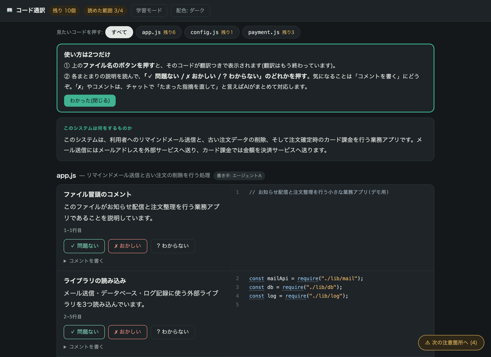
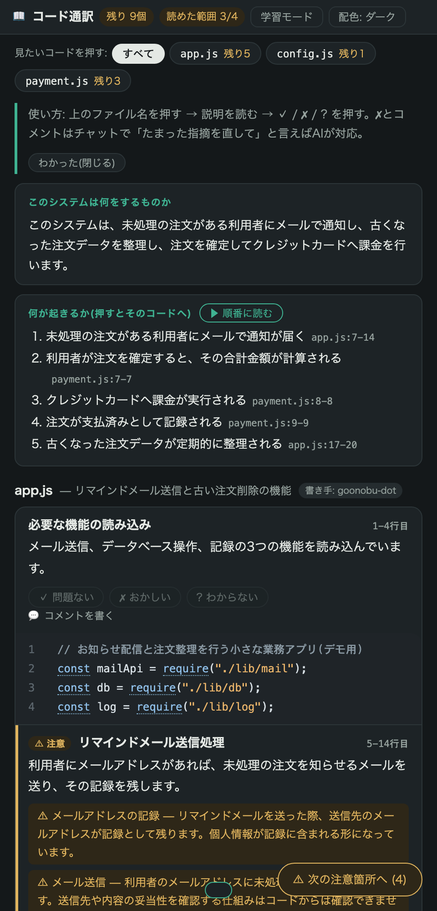
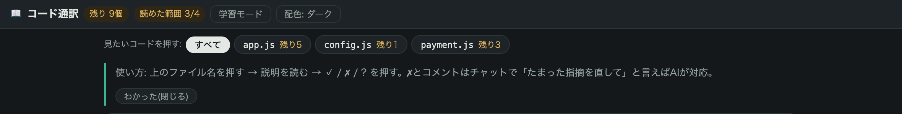
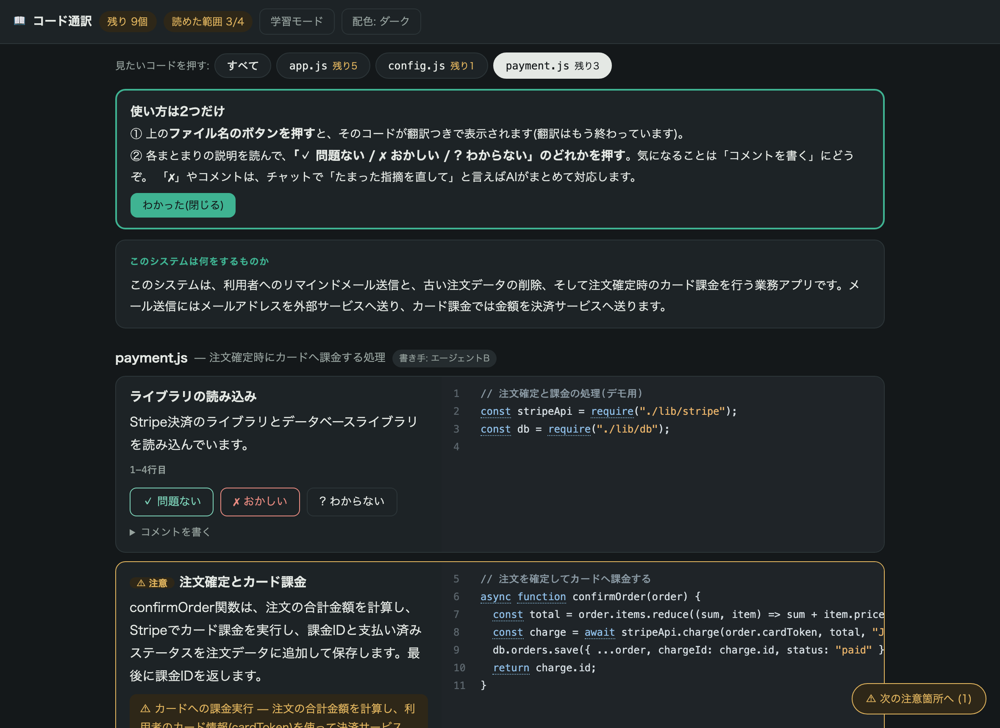
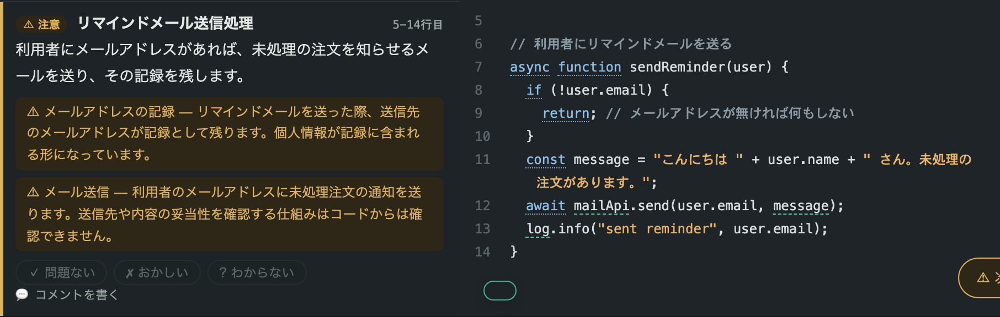
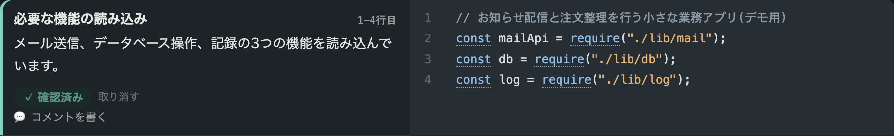
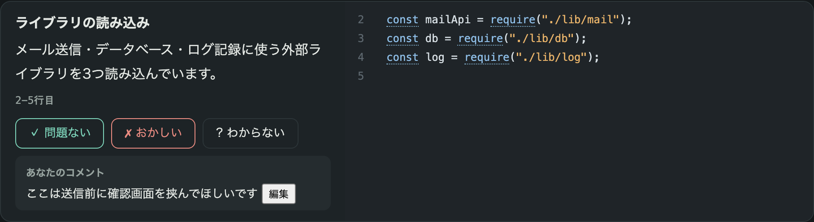
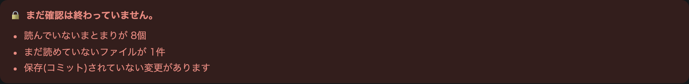
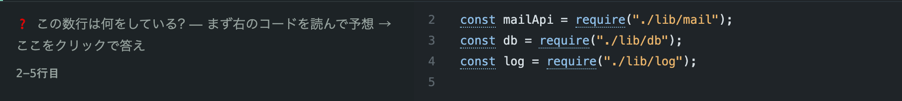

# コード通訳 操作マニュアル

**コードが読めなくても、AIが書いたコードを日本語で読んで、自分の言葉で確認できるツールです。**
このマニュアルは5分で読めます。むずかしい言葉は使いません。

---

## 読み終えると、こうなります

コードが「意味のまとまり」ごとに、**左=日本語の説明、右=コード**で並びます。
あなたがやることは、説明を読んで**3つのボタンのどれかを押すだけ**です。

画面が狭いとき(Claude Codeの横に並べたときやスマホ)は、自動で「説明の下にコード」の縦並びに変わります。どちらも同じ機能です。

---

## 0. ひらく(最初の1回だけ)

ひらき方は3つ。どれでも同じ画面が出ます。

| ひらき方 | 手順 |
|---|---|
| **A. チャットで頼む**(Claude Code利用者) | チャットに「**コードを翻訳して**」と打つ |
| **B. ダブルクリック** | フォルダ内の「**コード通訳を開く.command**」をダブルクリック(初回実行時に自動で置かれます) |
| **C. コマンド** | ターミナルで `code-translate 対象フォルダ --open` |

### ⏳ 最初に翻訳の待ち時間があります(いちばん大事な注意)

このツールは**先にAIがコード全体を読んで翻訳を作り、それから画面を開きます**。
押してすぐ画面が出るのではなく、**翻訳が終わるまで待つ**必要があります。

**目安は「コード1,000行あたり約1.5分」**(実測値。ファイル数が多いほど並列に処理するため効率は上がります)。

| コードの規模 | 待ち時間の目安 |
|---|---|
| 小さいアプリ(〜200行) | **約2分** |
| 中くらいのアプリ(約3,000行) | **約5分** |
| 大きめのアプリ(約8,000行) | **約12分** |

大きなプロジェクトでは10分を超えることもあります。実行中は「[7/35] ファイル名(残り約4.2分)」のように**進み具合と残り時間が表示される**ので、止まっているのか進んでいるのかが分かります。

- 待っている間は**画面は開きません**。終わると自動で開きます
- 待っている間、チャットで別の作業を頼んでも構いません
- **2回目からは、変更がなければ翻訳せずに一瞬で開きます**。変わった部分だけ作り直します
- 途中でやめても壊れません。もう一度頼めば続きから作られます

**お金の話**: 翻訳はお使いの**Claude Codeの利用枠の中で動きます。追加の請求はありません**(Pro/Maxなどの契約に含まれます)。
APIキーを直接使う設定の人だけ、通常どおりAPIの利用分がかかります。

---

## 1''. 2回目以降は「変わった所だけ」

一度翻訳したあとにコードを直したら、チャットで「**翻訳を更新して**」と言ってください。

- **変わったファイルだけ**訳し直します(数十秒。全部やり直しません)
- **前に付けた「✓問題ない」は消えません。** 変わった所だけ「🔄 再確認」に戻ります
- 画面上部の「**🆕 変更のみ**」を押すと、**前回から変わった所だけ**が並びます

これが日々の読み方です。**全部読むのは最初の1回だけ**で、あとは変わった所と赤い所だけ見れば済みます。

---

## 1'. 色で「重要な場所」が分かります

コードの中には、**事故につながりうる場所**があります。それを4段階の色で示します。

| 色 | 意味 | 具体例 |
|---|---|---|
| 🔴 **重大** | 事故につながりうる | 外部への送信・課金・削除・個人情報の扱い |
| 🟠 **要確認** | 内容を確かめたい | 異常時の動作、外部の部品の利用など |
| 🔵 **知っておく** | 知っておくとよい | 軽微な注意点 |
| 無色 | ふつうの処理 | 読み込みや表示など |

見出しの札(「🔴 重大 課金・削除など」)、左端の色帯、淡い背景の3つで示されます。
**外部への送信・課金や削除・個人情報**の3つは、程度が中くらいでも赤にしています。
非エンジニアが一番知りたいのがそこだからです。

**時間がないときは「🔴 危ない所だけ」を押してください。** 重要な箇所だけに絞られます。

> 色はAIの読み取りによる目印です。「安全のお墨付き」ではありません。
> 赤い所ほど、実際のコード(右側)と説明を見比べてください。

---

## 1. 見たいコードを押す

画面の上に**ファイル名のボタン**が並んでいます。押すと、そのコードが翻訳つきで表示されます。
ボタンの「残り◯」は、まだ確認していない数。ぜんぶ確認すると「✓」になります。
「すべて」を押せば全ファイルを続けて読めます。

---

## 2. 読む

1枚のカードが「**数行の意味のまとまり**」です。見方は3つだけ:

- **左上の太字** … この数行がやっていることの見出し
- **左の文章** … くわしい説明(ぜんぶ日本語)
- **右の黒い部分** … 実際のコード。**行にマウスを乗せると、その1行の訳**が出ます

**⚠マークのカード**は、お金・個人情報・削除など「事故につながりやすい箇所」です。
黄色い囲みに「何に注意すべきか」が書いてあります。右下の「**⚠ 次の注意箇所へ**」ボタンで、
⚠だけを順番に巡ることもできます。

---

## 3. 答える

読んだら、カードの下のボタンを押します。**正解を当てるテストではありません。**
「あなたが望んだ通りか」を答えるだけです。

| ボタン | 押すとき | そのあと |
|---|---|---|
| **✓ 問題ない** | 書いてある動きが、あなたの意図どおり | 記録されて次へ |
| **✗ おかしい** | そんな動きは頼んでいない・変だと思う | チャットで「たまった指摘を直して」と言うとAIが修正 |
| **? わからない** | 判断がつかない | チャットで「◯◯のまとまりを詳しく」と聞けば説明します |

押し間違えたら「取り消す」でやり直せます。
**押しただけではコードは変わりません**(記録が残るだけ)。直すのは、あなたがチャットで頼んだときです。

---

## 4. 気になることはコメントに書く

「コメントを書く」を開いて、ふつうの言葉で書いてください。
例:「ここは送信前に確認画面を挟んでほしい」。
✗と同じく、チャットで「**たまった指摘を直して**」と言えば、AIがコメントを読んで対応します。

### 「📮 指摘をAIへ送る」で直接送れます

✗・?・コメントが1件でもあると、**画面の左下にボタンが出ます**。押すだけでAIに届きます。

- **ページ版(ctrl+])で押した場合** — その画面が回答を保存し、AIに通知が届きます。
  あとはチャットで「**指摘を直して**」と言えば対応します
- **ブラウザで開いている場合** — 指摘の一覧がコピーされるので、チャットに貼り付けて送ってください

どちらでも結果は同じです。**「どう伝えればいいか」を考える必要はありません。**

---

## 5. 一番下の「判定」を見る

すべてのまとまりに「✓ 問題ない」と答え、未読ファイル・重大な検出・未保存の変更がなければ、
ここが緑の「**✅ 全部確認できました**」に変わります。
赤いあいだは、理由が箇条書きで出ます。**このツールは「安全です」とは言いません。**
「あなたが何を確認し、何が未確認か」を正直に表示するだけです。

---

## おまけ: 学習モード

右上の「**学習モード**」を押すと、説明が隠れて「❓この数行は何をしている?」だけになります。
**まずコードを自分で読んで予想 → クリックで答え合わせ**。
語学の単語カードと同じ仕組みで、毎日使ううちにコードが少しずつ読めるようになります。
(⚠の注意カードだけは、安全のため隠れません)

---

## よくある質問

**Q. コードを書き換えたら、前の回答はどうなる?**
A. 自動で無効になり、全カードが未回答に戻ります。「昔のコードへの承認」が新しいコードに使い回される事故を防ぐためです。画面は自動で新しい翻訳に切り替わります。

**Q. お金はかかる?**
A. **かかりません。** 翻訳はお使いのClaude Codeの利用枠の中で動くので、**追加の請求はありません**(Pro/Maxなどの契約に含まれます)。画面を開くのも何度でも無料です。
APIキーを直接使う設定の人だけ、通常どおりAPIの利用分がかかります。

**Q. 翻訳は間違わない?**
A. AIが書くので、間違うことがあります。だからこのツールは説明の隣に必ず実物のコードを置き、読めていないファイルは「未読」と赤で表示します。翻訳だけを信じず、⚠と判定を手がかりにしてください。

**Q. 回答やコメントはどこに保存される?**
A. 対象フォルダ内の `.code-translate/view/review.json` です。AIはこのファイルを読んで修正に使います。外部には送信されません。
